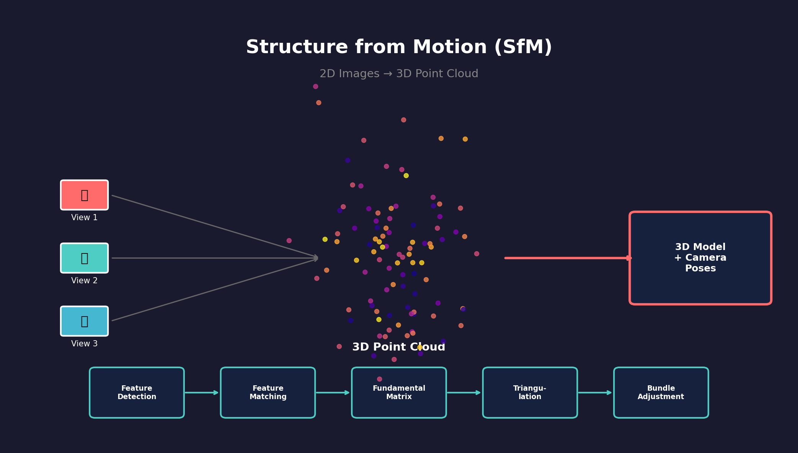
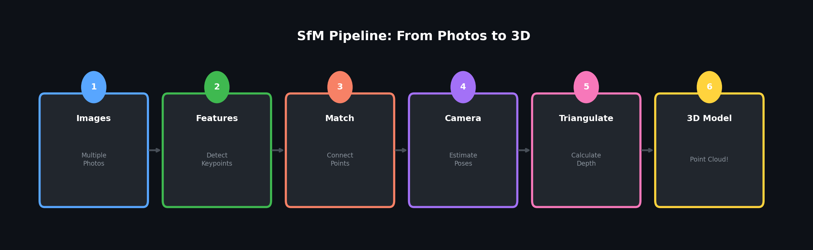

# 3D Reconstruction: Structure from Motion (SfM)

<p align="center">
  
</p>

[](https://python.org)
[](https://opencv.org)
[](LICENSE)

---
## 시작하며
이 프로젝트는 제가 혼자서 컴퓨터 비전을 공부하기 위해 **AI와 함께 코드를 구성하고 연계하여 학습하였습니다.** <br/>
주석, Readme 파일의 문장 정리 수준에서 **Claude Opus 4.5**의 말도 안되는 실력을 느낄 수 있습니다. 사람인 저는 그에 비해 부족하더라도
온전히 저의 학습을 위해 이용하였습니다.<br/>
문서 정리에도 AI 모델을 사용한 이유는 저 뿐만 아닌 다른 사람도 언제 봐도 편하게 하기 위함입니다.<br/>

사용 모델: Cluade Opus 4.5(단일 사용)<br/>
사용 편집기: Antigravity (Google)
---
## 🚀 TL;DR (한 줄 요약)

> **📸 사진 여러 장 → 🔮 3D 모델 생성!**
>
> 스마트폰으로 물체를 여러 각도에서 찍으면, 이 프로그램이 사진들을 분석해서 3D 포인트 클라우드를 만들어줍니다.

---

## 🎬 어떻게 작동하나요?

<p align="center">
  
</p>

### 📖 쉬운 설명 (5단계)

| 단계 | 이름 | 하는 일 | 비유 |
|:---:|------|---------|------|
| 1️⃣ | **이미지 입력** | 여러 각도에서 찍은 사진들을 준비 | 퍼즐 조각 모으기 |
| 2️⃣ | **특징점 검출** | 각 사진에서 눈에 띄는 점들 찾기 (모서리, 패턴 등) | 사진에서 "별표" 치기 |
| 3️⃣ | **특징점 매칭** | 다른 사진에서 같은 점 찾아 연결하기 | 같은 조각 찾아 연결 |
| 4️⃣ | **카메라 추정** | 각 사진이 어디서, 어떤 각도로 찍혔는지 계산 | 사진사 위치 추적 |
| 5️⃣ | **3D 복원** | 여러 시점 정보로 깊이를 계산해 3D 점 생성 | 퍼즐 완성! |

### 💡 핵심 원리

```
왼쪽 눈 👁️ -----> 물체 <----- 👁️ 오른쪽 눈
     \                           /
      \                         /
       \                       /
        \                     /
         ------> 뇌 👆 <------
                깊이 인식!
```

**우리 눈이 깊이를 인식하는 원리와 같습니다!** 
- 두 눈이 같은 물체를 약간 다른 각도로 봄 → 뇌가 깊이 계산
- 여러 사진이 같은 물체를 다른 각도로 촬영 → 알고리즘이 깊이 계산

---

## 🎢 프로젝트 시행착오 & 배운 점

이 프로젝트를 진행하면서 겪은 어려움과 해결 과정을 공유합니다.

### 😵 시행착오 1: 텍스처 없는 이미지의 실패

**문제**: 흰 벽이나 하늘 사진에서 특징점이 거의 검출되지 않음

**원인**: SIFT/ORB는 "변화"가 있는 곳에서만 특징점을 찾음

**해결**: 
- 텍스처가 풍부한 물체 촬영 권장
- 테스트 코드에서 예외 처리 추가

```python
if result.num_features < 10:
    print("⚠️ 특징점이 너무 적습니다. 텍스처가 풍부한 물체를 촬영하세요!")
```

### 😵 시행착오 2: 매칭 품질의 함정

**문제**: 특징점이 많이 매칭되었는데도 3D 결과가 이상함

**원인**: "나쁜 매칭"이 섞여 있으면 기하학 계산이 틀어짐

**해결**: 
- Lowe's ratio test (0.7 임계값) 적용
- RANSAC으로 outlier 제거

### 😵 시행착오 3: Python 버전 호환성

**문제**: Open3D가 Python 3.13에서 설치 안 됨

**원인**: Open3D가 아직 Python 3.13을 지원하지 않음

**해결**: 
- Matplotlib 3D를 fallback으로 구현
- 코드가 Open3D 없이도 작동하도록 설계

```python
def _detect_backend(self, backend):
    try:
        import open3d
        return "open3d"
    except ImportError:
        return "matplotlib"  # 자동 fallback!
```

---

## 📋 목차

- [개요](#-개요)
- [알고리즘 원리](#-알고리즘-원리)
- [설치](#-설치)
- [사용법](#-사용법)
- [프로젝트 구조](#-프로젝트-구조)
- [테스트](#-테스트)
- [참고 자료](#-참고-자료)

---

## 🎯 개요

이 프로젝트는 **Structure from Motion (SfM)** 알고리즘을 순수 Python으로 구현합니다. 여러 각도에서 촬영한 2D 이미지로부터 장면의 3D 구조와 카메라 위치를 동시에 복원합니다.

### 주요 기능

- 🔍 **특징점 검출**: SIFT, ORB 알고리즘 지원
- 🔗 **특징점 매칭**: BFMatcher, FLANN 기반 매칭
- 📐 **기하학적 추정**: Fundamental/Essential Matrix 계산
- 📷 **카메라 포즈 추정**: 상대적 R, t 복원
- 🔺 **삼각측량**: DLT 기반 3D 점 복원
- 🎯 **번들 조정**: 비선형 최적화로 정밀도 향상
- 👁️ **3D 시각화**: Open3D/Matplotlib 지원

---

## 📐 알고리즘 원리

### 1. 에피폴라 기하학 (Epipolar Geometry)

두 이미지 사이의 기하학적 관계는 **기초 행렬(Fundamental Matrix)** 식에 의해 정의됩니다:

$$x'^T F x = 0$$

여기서:
- $x$, $x'$는 각각 첫 번째와 두 번째 이미지의 동차 좌표 대응점
- $F$는 3×3 기초 행렬 (rank 2)

### 2. 에센셜 행렬 (Essential Matrix)

카메라 내부 파라미터 $K$가 알려진 경우, 에센셜 행렬 $E$는 다음과 같이 계산됩니다:

$$E = K'^T F K$$

에센셜 행렬은 카메라 간의 **회전 행렬 $R$** 과 **평행이동 벡터 $t$** 로 분해됩니다:

$$E = [t]_\times R$$

### 3. 삼각측량 (Triangulation)

두 카메라의 투영 행렬 $P_1$, $P_2$와 대응점 $x_1$, $x_2$가 주어지면, 3D 점 $X$는 다음 관계를 통해 복원됩니다:

$$x_1 = P_1 X, \quad x_2 = P_2 X$$

**DLT(Direct Linear Transform)** 방식으로 $AX = 0$ 형태의 선형 시스템을 풀어 3D 좌표를 계산합니다.

### 4. 번들 조정 (Bundle Adjustment)

모든 재투영 에러의 합을 최소화하는 비선형 최적화:

$$\min_{C_i, X_j} \sum_i \sum_j \| x_{ij} - \pi(C_i, X_j) \|^2$$

여기서:
- $x_{ij}$: $j$번째 3D 점의 $i$번째 카메라에서의 2D 관측
- $\pi$: 투영 함수
- $C_i$: $i$번째 카메라 파라미터

### 5. 성능 지표

알고리즘의 정확도는 **정답 매칭 개수**와 **전체 매칭 시도 횟수** 사이의 비율로 계산됩니다:

$$\text{Precision} = \frac{\text{True Positives}}{\text{True Positives} + \text{False Positives}}$$

---

## 🚀 설치

### 요구사항

- Python 3.8 이상
- OpenCV 4.5 이상 (opencv-contrib-python 권장)

### 설치 방법

```bash
# 저장소 클론
git clone https://github.com/yourusername/3D_reconstruction.git
cd 3D_reconstruction

# 가상환경 생성 (권장)
python -m venv venv
source venv/bin/activate  # Linux/Mac
# venv\Scripts\activate   # Windows

# 의존성 설치
pip install -r requirements.txt
```

---

## 💻 사용법

### 기본 사용

```python
from src.sfm_pipeline import SfMPipeline, create_default_camera_matrix
import cv2

# 이미지 크기에 맞는 카메라 행렬 생성
K = create_default_camera_matrix(width=1920, height=1080, fov_degrees=60)

# SfM 파이프라인 생성
pipeline = SfMPipeline(K, feature_algorithm="sift")

# 이미지 목록으로 3D 재구성 실행
image_paths = ["image1.jpg", "image2.jpg", "image3.jpg"]
result = pipeline.run(image_paths)

if result is not None:
    print(f"복원된 3D 점: {result.num_points}개")
    print(f"재투영 에러: {result.reprojection_error:.4f} 픽셀")
    
    # 포인트 클라우드 저장
    pipeline.save_point_cloud(result, "output.ply")
```

### 개별 모듈 사용

```python
# 특징점 검출
from src.feature_detection import FeatureDetector

detector = FeatureDetector(algorithm="sift")
result = detector.detect(image)
print(f"검출된 특징점: {result.num_features}개")

# 특징점 매칭
from src.feature_matching import FeatureMatcher

matcher = FeatureMatcher(matcher_type="bf")
match_result = matcher.match(descriptors1, descriptors2)
print(f"좋은 매칭: {match_result.num_good}개")

# 기초 행렬 계산
from src.fundamental_matrix import FundamentalMatrixEstimator

estimator = FundamentalMatrixEstimator(method="ransac")
F_result = estimator.estimate(pts1, pts2)
print(f"인라이어 비율: {F_result.inlier_ratio:.2%}")
```

### 커맨드라인 실행

```bash
# 데모 실행
python examples/demo.py

# 이미지로 SfM 실행
python -m src.sfm_pipeline image1.jpg image2.jpg image3.jpg

# 테스트 실행
python -m pytest tests/ -v
```

### 3D 시각화

```python
from visualization.point_cloud_viewer import PointCloudVisualizer, load_ply

# PLY 파일 로드 및 시각화
points, colors = load_ply("output.ply")

viz = PointCloudVisualizer()
viz.visualize(points, colors, title="My Point Cloud")
```

---

## 📁 프로젝트 구조

```
3D_reconstruction/
├── src/                          # 핵심 라이브러리
│   ├── __init__.py
│   ├── feature_detection.py      # SIFT/ORB 특징점 검출
│   ├── feature_matching.py       # 특징점 매칭
│   ├── fundamental_matrix.py     # 기초 행렬 계산
│   ├── camera_pose.py            # 카메라 포즈 추정
│   ├── triangulation.py          # 삼각측량
│   ├── bundle_adjustment.py      # 번들 조정
│   └── sfm_pipeline.py           # 전체 파이프라인
│
├── visualization/                # 시각화 도구
│   └── point_cloud_viewer.py
│
├── tests/                        # 테스트
│   ├── test_images/
│   └── test_sfm.py
│
├── examples/                     # 예제
│   └── demo.py
│
├── docs/                         # 문서
│   └── images/
│
├── requirements.txt
└── README.md
```

---

## ✅ 테스트

### 전체 테스트 실행

```bash
python -m pytest tests/ -v
```

### 특정 모듈 테스트

```bash
# 특징점 검출 테스트
python -m pytest tests/test_sfm.py::TestFeatureDetection -v

# 기초 행렬 테스트
python -m pytest tests/test_sfm.py::TestFundamentalMatrix -v
```

### 테스트 이미지

다양한 특성의 테스트 이미지:

| 유형 | 설명 | 예상 결과 |
|------|------|----------|
| 텍스처 풍부 | 벽돌, 나뭇잎 등 | 1000+ 특징점 |
| 텍스처 부족 | 단색 벽면 | < 50 특징점 (실패 케이스) |
| 반복 패턴 | 타일, 창문 | 매칭 모호성 발생 가능 |

---

## 📚 참고 자료

### 논문

- Hartley, R., & Zisserman, A. (2004). *Multiple View Geometry in Computer Vision*
- Lowe, D. G. (2004). *Distinctive Image Features from Scale-Invariant Keypoints*
- Triggs, B., et al. (2000). *Bundle Adjustment - A Modern Synthesis*

### 라이브러리

- [OpenCV](https://opencv.org/) - 컴퓨터 비전 라이브러리
- [Open3D](http://www.open3d.org/) - 3D 데이터 처리
- [SciPy](https://scipy.org/) - 과학 계산

---

## 📄 라이선스

MIT License - 자세한 내용은 [LICENSE](LICENSE) 파일을 참조하세요.

---

